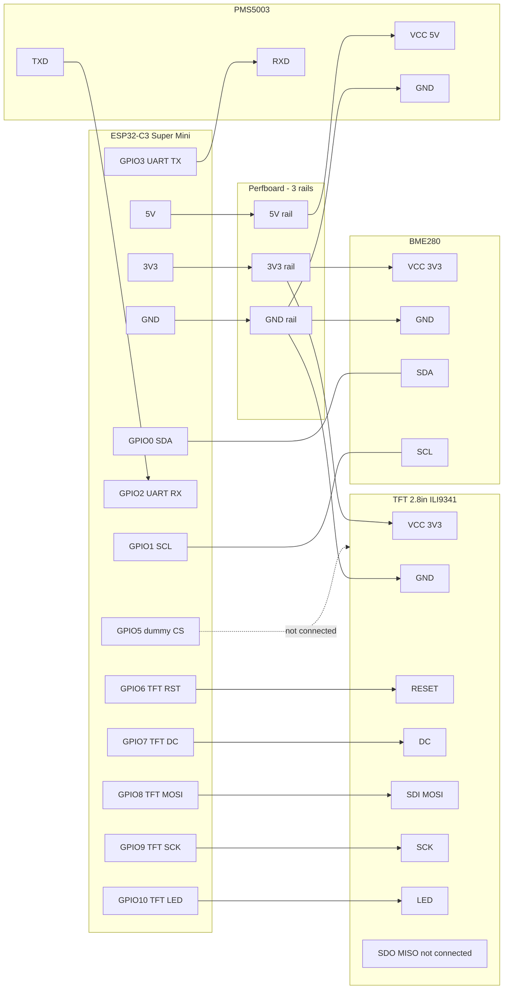

# ESP32-C3 Super Mini + PMS5003 + BME280 + 2.8in TFT (Rust)

`no_std` ESP32-C3 firmware using:

- `PMS5003` over UART1 for PM readings
- `BME280` over I2C for temperature, humidity, pressure
- `2.8" SPI TFT 240x320` (ILI9341-compatible) over SPI for on-device display

## Clear Wiring Diagram

ESP32-C3 Super Mini side:

`Left side:` `5V`, `GND`, `3V3`, `GPIO4`, `GPIO3`, `GPIO2`, `GPIO1`, `GPIO0`  
`Right side:` `GPIO5`, `GPIO6`, `GPIO7`, `GPIO8`, `GPIO9`, `GPIO10`, `GPIO20`, `GPIO21`

| ESP32-C3 pin | Connects to                              | Notes                           |
|:---------------|:---------------------------------------|:--------------------------------|
| `5V`           | PMS5003 `VCC`                          | PMS5003 power (5V)              |
| `GND`          | PMS5003 `GND`, BME280 `GND`, TFT `GND` | Shared ground                   |
| `GPIO2`        | PMS5003 `TXD`                          | UART1 RX                        |
| `GPIO3`        | PMS5003 `RXD`                          | UART1 TX (wake/active commands) |
| `3V3`          | BME280 `VIN/VCC`, TFT `VCC`            | 3.3V rail                       |
| `GPIO0`        | BME280 `SDA`                           | I2C SDA                         |
| `GPIO1`        | BME280 `SCL`                           | I2C SCL                         |
| `GPIO5`        | Not connected                          | Dummy CS in firmware only       |
| `GPIO6`        | TFT `RESET`                            | Display reset                   |
| `GPIO7`        | TFT `DC`                               | Data/command                    |
| `GPIO8`        | TFT `SDI(MOSI)`                        | SPI MOSI                        |
| `GPIO9`        | TFT `SCK`                              | SPI SCK                         |
| `GPIO10`       | TFT `LED`                              | Backlight enable (active high)  |

### Mermaid wiring overview



### TFT connector order (module side)

Given your module pin order:

- `GND`
- `VCC`
- `CLK`
- `SDI (MOSI)`
- `RESET`
- `DC`
- `BLK`
- `SDO (MISO)`

Use this mapping:

- `GND` -> ESP `GND`
- `VCC` -> ESP `3V3`
- `CLK` -> ESP `GPIO9`
- `RESET` -> ESP `GPIO6`
- `DC` -> ESP `GPIO7`
- `SDI (MOSI)` / `MOSI` -> ESP `GPIO8`
- `BLK` -> ESP `GPIO10`
- `SDO (MISO)` -> not connected (not used by firmware)

### TFT module pins not used by firmware

- `CS` (not present on this module; firmware keeps a dummy `CS` on `GPIO5`, leave it unconnected)
- `SDO(MISO)` (display readback)
- `T_CLK`, `T_CS`, `T_DIN`, `T_DO`, `T_IRQ` (touch controller)
- SD-card pins (`SD_CS`, `SD_MOSI`, `SD_MISO`, `SD_SCK`)

### PMS5003 8-pin connector mapping (sensor-side)

- `PIN1 VCC` -> ESP32-C3 Super Mini `5V`
- `PIN2 GND` -> ESP32-C3 Super Mini `GND`
- `PIN4 RX` -> ESP32-C3 Super Mini `GPIO3` (optional but recommended)
- `PIN5 TX` -> ESP32-C3 Super Mini `GPIO2`
- `PIN3 SET`, `PIN6 RESET`, `PIN7/8 NC` -> leave unconnected

If your PMS cable has no markings:

- Use your known reference first: `PIN1 = 5V`, `PIN2 = GND`.
- Then count pins in the same direction from `PIN1/PIN2`:
  - `PIN3 = SET` (leave unconnected)
  - `PIN4 = RX` (connect to ESP `GPIO3`)
  - `PIN5 = TX` (connect to ESP `GPIO2`)
  - `PIN6 = RESET` (leave unconnected)
  - `PIN7 = NC` (leave unconnected)
  - `PIN8 = NC` (leave unconnected)

### BME280 notes

- Firmware probes both `0x76` and `0x77` automatically.
- If your board is actually BMP280 (chip ID `0x58`), pressure/temp still work but humidity is not valid.

## What the firmware does

- Continuously reads and validates PMS5003 frames.
- Maintains a 24-hour rolling average of PM1.0 / PM2.5 / PM10 (one minute-bucket per minute, 1440 buckets max).
- Samples BME/BMP every 5 seconds.
- Redraws the TFT at most every 250 ms when data changes:
  - Semicircular EU AQI gauge driven by the 24 h PM2.5/PM10 average (worst band wins)
  - Air quality label in Swedish (see [EU AQI bands](#eu-aqi-bands) below)
  - PM1.0 / PM2.5 / PM10 (ATM, raw latest frame)
  - Particle counts (0.3, 0.5 µm bins)
  - Temperature, humidity, pressure

## EU AQI bands

The gauge and status label follow the **European Air Quality Index** thresholds for PM2.5 and PM10 (24-hour averages). The worse of the two bands determines the gauge position and label.

| Band | Swedish label | PM2.5 (µg/m³) | PM10 (µg/m³) |
| :---- | :------------ | :------------ | :----------- |
| Good | GOD LUFTKVALITET | 0 – 5 | 0 – 10 |
| Fair | GANSKA GOD LUFTKVALITET | 6 – 15 | 11 – 25 |
| Moderate | MÅTTLIGT GOD LUFTKVALITET | 16 – 50 | 26 – 90 |
| Poor | DÅLIG LUFTKVALITET | 51 – 90 | 91 – 180 |
| Very poor | MYCKET DÅLIG LUFTKVALITET | 91 – 140 | 181 – 280 |
| Extremely poor | EXTREMT DÅLIG LUFTKVALITET | > 140 | > 280 |

When PM2.5 drives the band the raw PM2.5 value positions the needle precisely. When PM10 drives the band a representative midpoint for that band on the PM2.5 scale is used instead.

All on-screen labels are in **Swedish**.

## Toolchain setup (once)

```bash
cargo +stable install espup --locked
espup install
cargo +stable install espflash --locked
```

## Build

```bash
cargo build
```

## Flash and monitor

Use the upload script for your serial port:

```bash
./upload.sh
```
